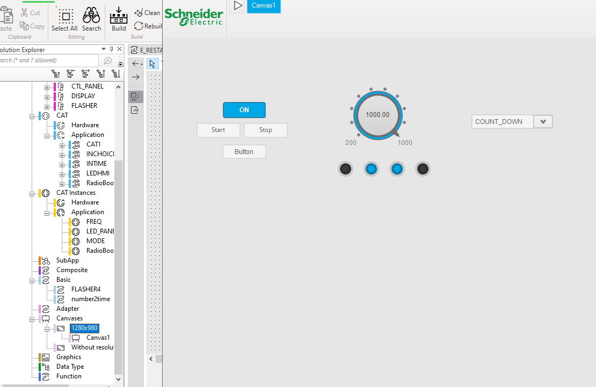

# IEC-61499-EcoStruxure-Automation-Expert
Introduces IEC 61499 development in EcoStruxure Automation Expert. Includes creating and testing basic and composite function blocks, editing ECCs and algorithms, and deploying a simple application to demonstrate distributed execution.

